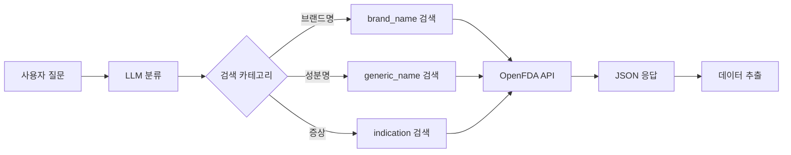
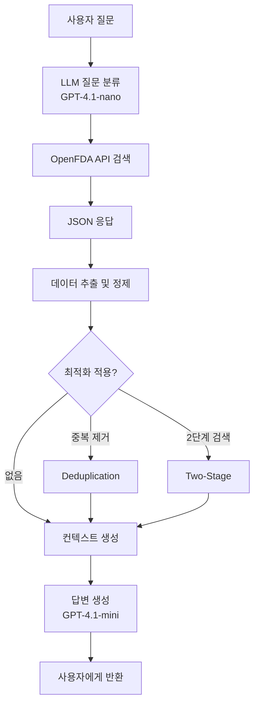

# 데이터 수집 및 전처리

## 📋 개요

FDA 의약품 정보 RAG (Retrieval-Augmented Generation) 시스템을 위한 데이터 수집 및 전처리 프로세스 문서입니다.

---

## 1. 데이터 소스

### 1.1 OpenFDA API

**공식 문서**: https://open.fda.gov/apis/

**사용 엔드포인트**:
- **Drug Labels**: `/drug/label.json`  
  FDA 승인 의약품 라벨 정보 (성분, 효능, 주의사항 등)

**데이터 특징**:
- ✅ 실시간 API 호출 방식
- ✅ 별도 데이터베이스 불필요
- ✅ FDA 공식 승인 데이터
- ✅ JSON 형식 응답

### 1.2 데이터 접근 방식

**구현 파일**: `src/api/openfda_client.py`

**검색 카테고리**:
1. **브랜드명 (brand_name)**  
   - 예: "Tylenol", "Advil"
   - API 필드: `openfda.brand_name`

2. **성분명 (generic_name)**  
   - 예: "Acetaminophen", "Ibuprofen"
   - API 필드: `openfda.generic_name`

3. **효능/증상 (indication)**  
   - 예: "headache", "pain relief"
   - API 필드: `indications_and_usage`

---

## 2. 데이터 수집 프로세스

### 2.1 검색 파이프라인



### 2.2 질문 분류 (Query Classification)

**모델**: GPT-4.1-nano  
**구현**: `src/chain/rag_chain.py` - `prepare_context()`

**분류 프로세스**:
```python
def prepare_context(question: str) -> Dict:
    # 1. LLM이 질문 분석
    # 2. 카테고리 결정 (brand_name/generic_name/indication)
    # 3. 영어 키워드 추출
    # 4. OpenFDA API 호출
    # 5. 컨텍스트 생성
```

**예시**:
```
질문: "타이레놀은 어떤 약인가요?"
→ category: "brand_name"
→ keyword: "Tylenol"
→ API: /drug/label.json?search=openfda.brand_name:"Tylenol"
```

### 2.3 API 호출 예시

**Request**:
```http
GET https://api.fda.gov/drug/label.json?
    search=openfda.brand_name:"Tylenol"&
    limit=20
```

**Response 구조**:
```json
{
  "results": [
    {
      "id": "...",
      "openfda": {
        "brand_name": ["TYLENOL"],
        "generic_name": ["ACETAMINOPHEN"],
        "manufacturer_name": ["Johnson & Johnson"]
      },
      "indications_and_usage": ["용법 텍스트..."],
      "warnings": ["주의사항 텍스트..."],
      "dosage_and_administration": ["용량 텍스트..."]
    }
  ]
}
```

---

## 3. 데이터 전처리

### 3.1 데이터 추출

**구현**: `src/api/formatter.py`

**추출 필드**:
| 필드명 | 설명 | 필수 여부 |
|--------|------|-----------|
| `openfda.brand_name` | 브랜드명 | 🔴 필수 |
| `openfda.generic_name` | 성분명 | 🔴 필수 |
| `indications_and_usage` | 효능/용법 | 🔴 필수 |
| `warnings` | 주의사항 | 🟡 중요 |
| `dosage_and_administration` | 용량/투여 | 🟡 중요 |
| `adverse_reactions` | 부작용 | 🟢 선택 |

### 3.2 텍스트 정제

**처리 작업**:
1. ✅ 배열 → 문자열 변환
2. ✅ NULL/빈 값 처리
3. ✅ 중복 공백 제거
4. ✅ 특수문자 정규화

**코드 예시**:
```python
def format_field(field_data):
    if isinstance(field_data, list):
        return ' '.join(field_data)
    return field_data or "정보 없음"
```

### 3.3 컨텍스트 포맷팅

**최종 구조**:
```markdown
### 약품 정보: Tylenol

**성분명**: Acetaminophen

**효능 및 용법**:
해열 및 진통 목적으로 사용됩니다...

**주의사항**:
과다 복용 시 간 손상 위험...

**용량 및 투여**:
성인: 500-1000mg, 4-6시간마다...
```

---

## 4. 평가 데이터셋

### 4.1 테스트 데이터 구조

**위치**: `evaluation/data/test_dataset.json`

**규모**: 100개 테스트 케이스

**데이터 구조**:
```json
{
  "question": "타이레놀은 어떤 약인가요?",
  "ground_truth": "타이레놀은 아세트아미노펜 성분의 해열진통제입니다...",
  "category": "brand_name",
  "keyword": "Tylenol"
}
```

### 4.2 카테고리 분포

| 카테고리 | 개수 | 비율 | 예시 |
|----------|------|------|------|
| `brand_name` | 40 | 40% | "타이레놀의 효능은?" |
| `generic_name` | 40 | 40% | "아이부프로펜 부작용은?" |
| `indication` | 20 | 20% | "두통약 추천해줘" |

### 4.3 데이터 품질 기준

✅ **필수 조건**:
- OpenFDA API에서 검색 가능
- 명확한 정답(ground_truth) 존재
- 자연스러운 한국어 질문

✅ **품질 지표**:
- 난이도 분포: 쉬움 30%, 보통 50%, 어려움 20%
- 답변 가능율: 100%
- 중복 질문: 0%

---

## 5. 데이터 최적화 기법

### 5.1 중복 제거 (Deduplication)

**문제**: 동일 성분의 서로 다른 제형이 모두 검색됨  
(예: Tylenol Regular, Tylenol Extra Strength, Tylenol 8HR)

**해결**: `src/optimizations.py` - `deduplicate_by_generic_name()`

```python
def deduplicate_by_generic_name(results):
    # generic_name으로 그룹화
    # 각 그룹에서 첫 번째만 선택
    seen = set()
    deduped = []
    for result in results:
        generic = result.get('generic_name')
        if generic not in seen:
            seen.add(generic)
            deduped.append(result)
    return deduped
```

**효과**: Context Precision 향상

### 5.2 두 단계 검색 (Two-Stage Retrieval)

**1단계**: 광범위 검색 (20개)  
**2단계**: LLM 기반 재정렬 후 상위 5개 선택

**효과**: Context Recall 향상

---

## 6. 데이터 파이프라인 요약



---

## 7. 관련 파일

- **API 클라이언트**: [`src/api/openfda_client.py`](../src/api/openfda_client.py)
- **데이터 포매터**: [`src/api/formatter.py`](../src/api/formatter.py)
- **RAG 체인**: [`src/chain/rag_chain.py`](../src/chain/rag_chain.py)
- **최적화 기능**: [`src/optimizations.py`](../src/optimizations.py)
- **테스트 데이터**: [`evaluation/data/test_dataset.json`](../evaluation/data/test_dataset.json)

---

## 8. 참고 자료

- [OpenFDA API 공식 문서](https://open.fda.gov/apis/)
- [OpenFDA Drug Label 필드 설명](https://open.fda.gov/apis/drug/label/)
- [LangChain 문서](https://python.langchain.com/)
