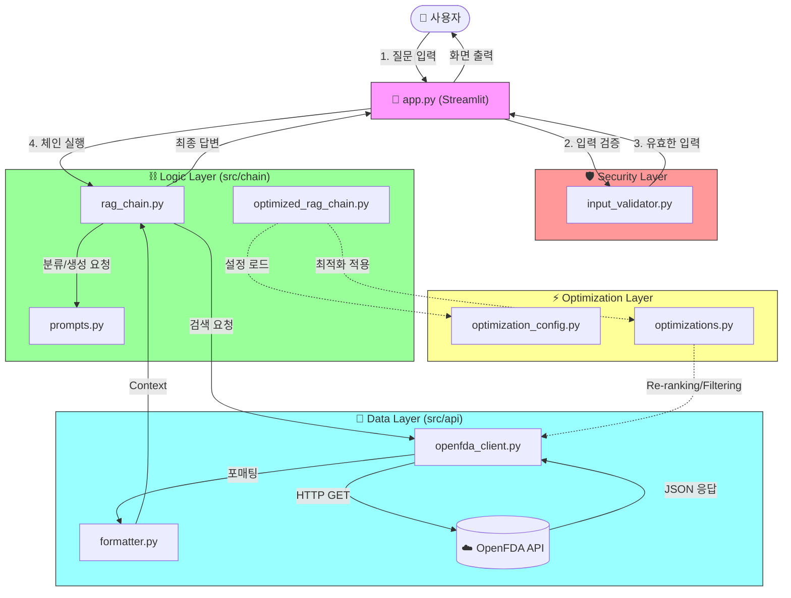
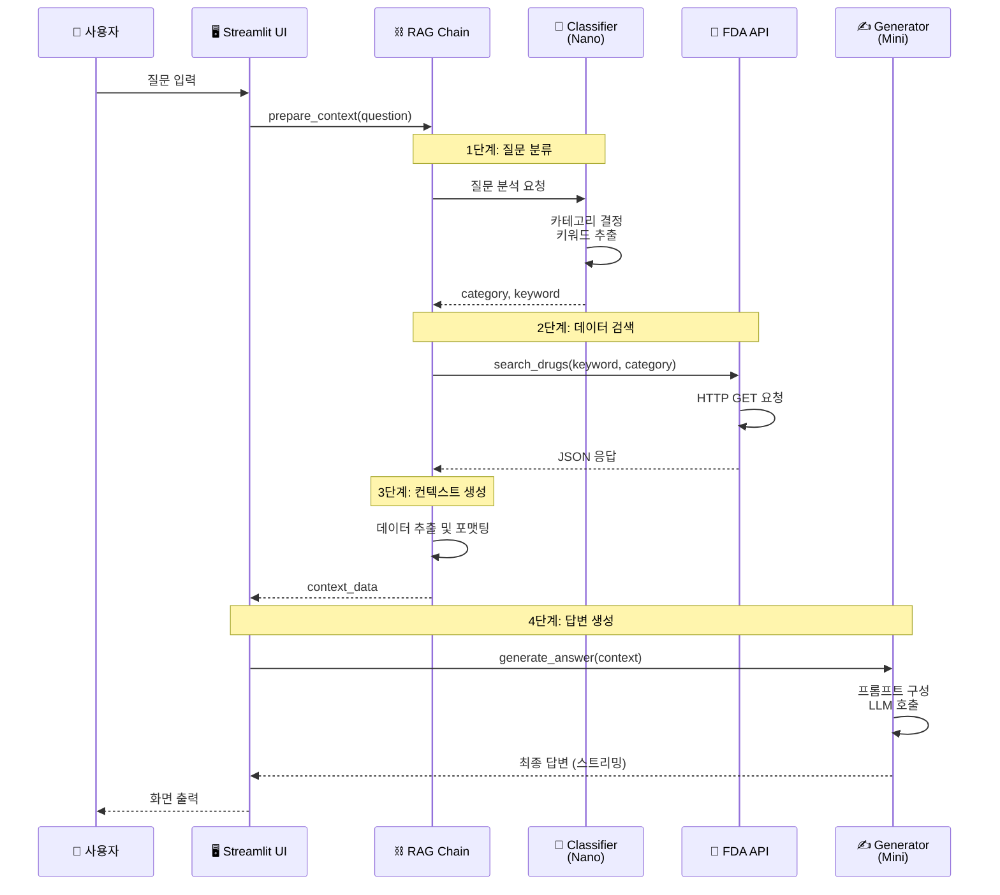

# 시스템 아키텍처

## 📋 개요

FDA 의약품 정보 Q&A 시스템의 전체 아키텍처 및 구성 요소를 설명합니다.

---

## 1. 시스템 개요

### 1.1 시스템 목적

미국 FDA 공공데이터(OpenFDA)를 활용한 **실시간 의약품 정보 챗봇**

### 1.2 핵심 특징

- ✅ **RAG 기반**: 사실 기반 답변 생성
- ✅ **실시간 데이터**: OpenFDA API 직접 호출
- ✅ **다중 LLM**: 용도별 최적화된 모델 사용
- ✅ **Streamlit UI**: 직관적인 채팅 인터페이스

---

## 2. 전체 아키텍처

### 2.1 시스템 구성도

사용자의 질문을 분석하여 적절한 API 엔드포인트를 호출하고, 결과를 종합하여 답변을 생성합니다.



### 2.2 레이어별 역할

#### 프레젠테이션 레이어
- **역할**: 사용자 인터페이스 제공
- **기술**: Streamlit
- **파일**: `app.py`

#### 애플리케이션 레이어
- **역할**: 비즈니스 로직 및 RAG 파이프라인
- **기술**: LangChain, OpenAI LLM
- **파일**: `src/chain/`

#### 데이터 레이어
- **역할**: 외부 데이터 소스 연동
- **기술**: OpenFDA API, HTTP Client
- **파일**: `src/api/`

---

## 3. RAG 파이프라인

### 3.1 RAG 흐름도



### 3.2 단계별 상세

#### 1️⃣ 질문 분류 (Query Classification)

**모델**: GPT-4.1-nano  
**입력**: 사용자 질문  
**출력**: 
```python
{
  "category": "brand_name",  # brand_name/generic_name/indication
  "keyword": "Tylenol"       # 영어 검색 키워드
}
```

#### 2️⃣ 데이터 검색 (Retrieval)

**API**: OpenFDA Drug Label API  
**검색 필드**:
- `openfda.brand_name`: 브랜드명 검색
- `openfda.generic_name`: 성분명 검색
- `indications_and_usage`: 효능 검색

**결과**: 최대 20개 의약품 정보

#### 3️⃣ 컨텍스트 생성 (Context Formatting)

**프로세스**:
1. JSON → 텍스트 변환
2. 필수 필드 추출
3. 마크다운 포맷팅
4. 컨텍스트 문자열 생성

#### 4️⃣ 답변 생성 (Answer Generation)

**모델**: GPT-4.1-mini  
**프롬프트**: `src/chain/prompts.py`  
**출력**: 스트리밍 응답

---

## 4. 핵심 컴포넌트

### 4.1 Streamlit 앱 (app.py)

**역할**:
- 채팅 UI 제공
- 세션 관리
- 스트리밍 응답 처리

**주요 기능**:
```python
# 1. 채팅 히스토리 관리
if "messages" not in st.session_state:
    st.session_state.messages = []

# 2. 사용자 입력 처리
if prompt := st.chat_input("질문을 입력하세요"):
    st.session_state.messages.append({"role": "user", "content": prompt})

# 3. RAG 응답 생성
context_data = prepare_context(prompt)
response = stream_answer(context_data)
```

### 4.2 RAG Chain (rag_chain.py)

**핵심 함수**:

#### `prepare_context(question: str) -> Dict`
- 질문 분류
- OpenFDA API 검색
- 컨텍스트 생성

#### `generate_answer(context_data: Dict) -> str`
- 프롬프트 구성
- LLM 호출
- 답변 반환

#### `stream_answer(context_data: Dict) -> Generator`
- 스트리밍 응답 생성

### 4.3 OpenFDA Client (openfda_client.py)

**핵심 함수**:

```python
def search_drugs(query: str, category: str, limit: int = 20) -> List[Dict]:
    """
    OpenFDA API 검색
    
    Args:
        query: 검색어
        category: brand_name/generic_name/indication
        limit: 결과 개수
    
    Returns:
        검색 결과 리스트
    """
```

### 4.4 Formatter (formatter.py)

**역할**: JSON 응답 → 텍스트 변환

```python
def format_drug_info(drug_data: Dict) -> str:
    """
    의약품 정보 포맷팅
    
    Returns:
        마크다운 형식 문자열
    """
```

---

## 5. 기술 스택

### 5.1 프레임워크 및 라이브러리

| 분류 | 기술 | 버전 | 용도 |
|------|------|------|------|
| **UI** | Streamlit | 최신 | 채팅 인터페이스 |
| **Orchestration** | LangChain | 최신 | RAG 파이프라인 |
| **LLM** | OpenAI API | - | GPT 모델 사용 |
| **HTTP Client** | requests | 최신 | API 호출 |

### 5.2 LLM 모델 전략

| 용도 | 모델 | 이유 |
|------|------|------|
| **질문 분류** | GPT-4.1-nano | 빠르고 저렴, 단순 분류 작업 |
| **답변 생성** | GPT-4.1-mini | 균형잡힌 성능/비용, 복잡한 생성 작업 |

---

## 6. 데이터 흐름

### 6.1 요청-응답 플로우

```
[사용자 질문]
    ↓
[Streamlit UI] ← 입력 받기
    ↓
[RAG Chain] ← prepare_context() 호출
    ↓
[Classifier LLM] ← 질문 분석
    ↓
[OpenFDA API] ← HTTP GET 요청
    ↓
[JSON 파싱 및 포맷팅]
    ↓
[Generator LLM] ← 답변 생성
    ↓
[Streamlit UI] ← 스트리밍 출력
    ↓
[사용자에게 표시]
```

### 6.2 에러 처리

**레벨별 에러 처리**:
1. **API 레벨**: HTTP 에러, Timeout
2. **체인 레벨**: 빈 응답, 형식 오류
3. **UI 레벨**: 사용자 알림

---

## 7. 최적화 기법

### 7.1 성능 최적화

- ✅ **스트리밍 응답**: 빠른 피드백
- ✅ **적절한 모델 선택**: Nano/Mini 조합
- ✅ **효율적인 API 호출**: 필요한 필드만 요청

### 7.2 RAG 최적화

**구현**: `src/optimization_config.py`

#### 옵션 1: 중복 제거
- 동일 성분 제품 제거
- Context Precision 향상

#### 옵션 2: 두 단계 검색
- 광범위 검색 → LLM 재정렬
- Context Recall 향상

#### 옵션 3: GPT-4 업그레이드
- 더 강력한 모델 사용
- 전반적 품질 향상

---

## 8. 보안 및 검증

### 8.1 입력 검증

**구현**: `src/security/`

- ✅ SQL Injection 방지
- ✅ XSS 방지
- ✅ 입력 길이 제한

### 8.2 API 키 관리

**방식**: 환경 변수 (`.env`)

```env
OPENAI_API_KEY=sk-...
OPENFDA_API_KEY=...
LANGSMITH_API_KEY=...
```

### 8.3 에러 로깅

**도구**: LangSmith (선택사항)

---

## 9. 배포 고려사항

### 9.1 환경 변수

필수:
- `OPENAI_API_KEY`

선택:
- `OPENFDA_API_KEY` (높은 API 한도)
- `LANGSMITH_API_KEY` (모니터링)

### 9.2 실행 명령

```bash
streamlit run app.py
```

### 9.3 시스템 요구사항

- Python 3.8+
- 인터넷 연결 (API 호출용)
- OpenAI API 크레딧

---

## 10. 관련 파일

- **메인 앱**: [`app.py`](../app.py)
- **RAG 체인**: [`src/chain/rag_chain.py`](../src/chain/rag_chain.py)
- **프롬프트**: [`src/chain/prompts.py`](../src/chain/prompts.py)
- **API 클라이언트**: [`src/api/openfda_client.py`](../src/api/openfda_client.py)
- **설정**: [`src/config.py`](../src/config.py)

---

## 11. 참고 자료

- [Streamlit 문서](https://docs.streamlit.io/)
- [LangChain 문서](https://python.langchain.com/)
- [OpenFDA API](https://open.fda.gov/apis/)
- [OpenAI API](https://platform.openai.com/docs/)
