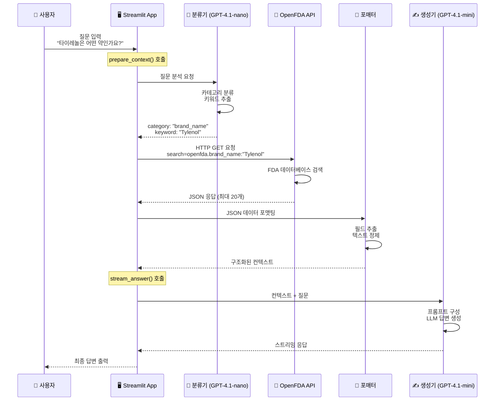

# OpenFDA API → RAG Chain → 답변 생성 전체 프로세스

## 📋 개요

사용자 질문이 입력되면 OpenFDA API를 통해 데이터를 검색하고, RAG Chain을 거쳐 최종 답변이 생성되는 전체 프로세스를 단계별로 설명합니다.

---

## 🔄 전체 흐름도



---

## 📍 단계별 상세 설명

### 1단계: 사용자 질문 입력

**예시 질문**:
```
"타이레놀은 어떤 약인가요?"
```

**코드 위치**: `app.py`
```python
if prompt := st.chat_input("질문을 입력하세요"):
    st.session_state.messages.append({"role": "user", "content": prompt})
```

---

### 2단계: 질문 분류 (classify)

**목적**: LLM을 사용해 질문의 의도를 파악하고 검색 카테고리 결정

**코드**: `src/chain/rag_chain.py`
```python
def classify(question: str) -> dict:
    """사용자 질문을 분류하여 category, keyword 반환"""
    llm = ChatOpenAI(model="gpt-4.1-nano", temperature=0.0)
    prompt = CLASSIFIER_PROMPT.format(question=question)
    result = llm.invoke(prompt)
    
    parsed = json.loads(result.content.strip())
    
    return {
        "question": question,
        "category": parsed.get("category", "brand_name"),
        "keyword": parsed.get("keyword", question)
    }
```

**입력**:
```
질문: "타이레놀은 어떤 약인가요?"
```

**출력**:
```json
{
  "question": "타이레놀은 어떤 약인가요?",
  "category": "brand_name",
  "keyword": "Tylenol"
}
```

**카테고리 종류**:
- `brand_name`: 브랜드명 검색 (예: "Tylenol")
- `generic_name`: 성분명 검색 (예: "Acetaminophen")
- `indication`: 효능/증상 검색 (예: "headache")
- `invalid`: 의약품과 무관한 질문

---

### 3단계: OpenFDA API 호출

**코드**: `src/api/openfda_client.py`

#### 3.1 API 요청 구성

```python
def search_by_brand_name(brand_name: str, limit: int = 20) -> list[dict]:
    """브랜드명으로 FDA Drug Label API 검색"""
    
    # API 엔드포인트
    url = "https://api.fda.gov/drug/label.json"
    
    # 검색 파라미터
    params = {
        "search": f'openfda.brand_name:"{brand_name}"',
        "limit": limit
    }
    
    # HTTP GET 요청
    response = requests.get(url, params=params, timeout=10)
    response.raise_for_status()
    
    data = response.json()
    return data.get("results", [])
```

#### 3.2 실제 API 호출 예시

**요청 URL**:
```
https://api.fda.gov/drug/label.json?
  search=openfda.brand_name:"Tylenol"&
  limit=20
```

**응답 구조**:
```json
{
  "results": [
    {
      "id": "...",
      "openfda": {
        "brand_name": ["TYLENOL"],
        "generic_name": ["ACETAMINOPHEN"],
        "manufacturer_name": ["Johnson & Johnson"]
      },
      "indications_and_usage": [
        "temporary relief of minor aches and pains..."
      ],
      "warnings": [
        "Liver warning: Contains acetaminophen..."
      ],
      "dosage_and_administration": [
        "adults and children 12 years and over..."
      ]
    }
  ]
}
```

#### 3.3 카테고리별 검색 함수

```python
# 1. 브랜드명 검색
search_by_brand_name("Tylenol")
# → openfda.brand_name:"Tylenol"

# 2. 성분명 검색
search_by_generic_name("Acetaminophen")
# → openfda.generic_name:"Acetaminophen"

# 3. 효능 검색
search_by_indication("headache")
# → indications_and_usage:"headache"
```

---

### 4단계: 데이터 포맷팅

**목적**: JSON 응답을 LLM이 이해하기 쉬운 텍스트로 변환

**코드**: `src/api/formatter.py`

```python
def format_label_results(results: list[dict]) -> str:
    """
    OpenFDA Label API 응답을 컨텍스트 문자열로 변환
    """
    if not results:
        return "(검색 결과가 없습니다.)"
    
    formatted_parts = []
    
    for idx, item in enumerate(results, start=1):
        openfda = item.get("openfda", {})
        
        # 필드 추출
        brand_name = _safe_join(openfda.get("brand_name", []))
        generic_name = _safe_join(openfda.get("generic_name", []))
        manufacturer = _safe_join(openfda.get("manufacturer_name", []))
        
        indications = _safe_join(item.get("indications_and_usage", []))
        warnings = _safe_join(item.get("warnings", []))
        dosage = _safe_join(item.get("dosage_and_administration", []))
        
        # 포맷팅
        drug_info = f"""
[약품 {idx}]
브랜드: {brand_name}
성분명: {generic_name}
제조사: {manufacturer}

[효능 및 용법]
{indications[:500]}

[주의사항]
{warnings[:500]}

[용량]
{dosage[:300]}
        """
        
        formatted_parts.append(drug_info.strip())
    
    return "\n\n---\n\n".join(formatted_parts)
```

**입력**: OpenFDA JSON 응답

**출력**: 
```
[약품 1]
브랜드: TYLENOL
성분명: ACETAMINOPHEN
제조사: Johnson & Johnson

[효능 및 용법]
temporary relief of minor aches and pains due to: 
headache, muscular aches, backache...

[주의사항]
Liver warning: This product contains acetaminophen. 
Severe liver damage may occur if...

[용량]
adults and children 12 years and over: 
take 2 caplets every 4 to 6 hours...
```

---

### 5단계: 컨텍스트 준비 (prepare_context)

**목적**: 분류 + 검색 + 포맷팅을 한 번에 수행

**코드**: `src/chain/rag_chain.py`

```python
def prepare_context(question: str) -> dict:
    """
    분류 + API 호출 + 컨텍스트 구성
    """
    # 1. 질문 분류
    classification = classify(question)
    
    # 2. API 호출
    if classification["category"] == "brand_name":
        results = search_by_brand_name(classification["keyword"])
    elif classification["category"] == "generic_name":
        results = search_by_generic_name(classification["keyword"])
    elif classification["category"] == "indication":
        results = search_by_indication(classification["keyword"])
    else:
        results = []
    
    # 3. 포맷팅
    context = format_label_results(results)
    
    # 4. 반환
    return {
        "question": question,
        "category": classification["category"],
        "keyword": classification["keyword"],
        "context": context,
        "raw_results": results
    }
```

**반환 데이터**:
```python
{
    "question": "타이레놀은 어떤 약인가요?",
    "category": "brand_name",
    "keyword": "Tylenol",
    "context": "[약품 1]\n브랜드: TYLENOL\n...",
    "raw_results": [...]  # 원본 JSON
}
```

---

### 6단계: 답변 생성 (generate_answer)

**목적**: 컨텍스트를 기반으로 LLM이 자연스러운 답변 생성

**코드**: `src/chain/rag_chain.py`

```python
def generate_answer(context_data: dict) -> str:
    """
    컨텍스트 데이터로 전체 답변 생성 (비스트리밍)
    """
    llm = ChatOpenAI(
        model="gpt-4.1-mini",
        temperature=0.0
    )
    
    # 프롬프트 구성
    prompt = GENERATOR_PROMPT.format_messages(
        question=context_data["question"],
        category=context_data["category"],
        keyword=context_data["keyword"],
        context=context_data["context"],
        dur_context="(OpenFDA에서는 병용금지 정보를 제공하지 않습니다.)"
    )
    
    # LLM 호출
    result = llm.invoke(prompt)
    return result.content
```

**프롬프트 예시** (`src/chain/prompts.py`):
```
당신은 FDA 의약품 정보 전문가입니다.

검색된 약품 정보:
[약품 1]
브랜드: TYLENOL
성분명: ACETAMINOPHEN
...

질문: 타이레놀은 어떤 약인가요?

위 정보를 바탕으로 정확하고 친절하게 답변하세요.
```

**최종 답변**:
```
타이레놀(TYLENOL)은 아세트아미노펜(Acetaminophen) 성분의 해열진통제입니다.

【주요 효능】
- 두통, 근육통, 요통 등 경미한 통증 완화
- 감기로 인한 발열 완화

【용법】
성인 및 12세 이상: 4-6시간마다 2정 복용

【주의사항】
⚠️ 간 손상 위험: 과다 복용 시 심각한 간 손상이 발생할 수 있습니다.
```

---

### 7단계: 스트리밍 출력 (stream_answer)

**목적**: 답변을 실시간으로 출력하여 사용자 경험 개선

**코드**: `src/chain/rag_chain.py`

```python
def stream_answer(context_data: dict) -> Generator[str, None, None]:
    """
    컨텍스트 데이터로 스트리밍 답변 생성
    """
    llm = ChatOpenAI(
        model="gpt-4.1-mini",
        temperature=0.0,
        streaming=True  # 스트리밍 활성화
    )
    
    prompt = GENERATOR_PROMPT.format_messages(
        question=context_data["question"],
        category=context_data["category"],
        keyword=context_data["keyword"],
        context=context_data["context"]
    )
    
    # 청크 단위로 반환
    for chunk in llm.stream(prompt):
        if chunk.content:
            yield chunk.content
```

**Streamlit 연동** (`app.py`):
```python
# 컨텍스트 준비
context_data = prepare_context(user_question)

# 스트리밍 답변 생성
with st.chat_message("assistant"):
    response = st.write_stream(stream_answer(context_data))
```

---

## 📊 전체 데이터 흐름 요약

```
1. 사용자 입력
   "타이레놀은 어떤 약인가요?"
   
2. LLM 분류 (Classifier)
   → category: "brand_name"
   → keyword: "Tylenol"
   
3. OpenFDA API 호출
   → GET /drug/label.json?search=openfda.brand_name:"Tylenol"
   → JSON 응답 (20개 결과)
   
4. 데이터 포맷팅
   → JSON → 구조화된 텍스트 변환
   → 컨텍스트 생성
   
5. LLM 답변 생성 (Generator)
   → 컨텍스트 + 질문 → 프롬프트 구성
   → 답변 생성
   
6. 사용자에게 출력
   → 스트리밍 방식으로 실시간 표시
```

---

## 🔧 핵심 컴포넌트

### 1. 분류기 (Classifier)
- **모델**: GPT-4.1-nano
- **역할**: 질문 의도 파악, 검색 전략 결정
- **출력**: category, keyword

### 2. OpenFDA Client
- **API**: https://api.fda.gov/drug/label.json
- **역할**: FDA 데이터베이스 검색
- **출력**: JSON 형식 의약품 정보

### 3. 포매터 (Formatter)
- **역할**: JSON → 텍스트 변환
- **출력**: 구조화된 컨텍스트

### 4. 생성기 (Generator)
- **모델**: GPT-4.1-mini
- **역할**: 최종 답변 생성
- **출력**: 자연스러운 한국어 답변

---

## 💡 최적화 포인트

### 1. 분류 정확도
- 정확한 카테고리 분류로 검색 품질 향상
- 프롬프트 엔지니어링 중요

### 2. API 호출 효율
- 적절한 `limit` 설정 (기본 20개)
- 타임아웃 처리

### 3. 컨텍스트 크기
- 너무 많은 정보 → 답변 품질 저하
- 너무 적은 정보 → 정보 부족
- 균형 필요

### 4. 답변 생성
- Temperature=0 → 일관된 답변
- 스트리밍 → 빠른 사용자 피드백

---

## 📁 관련 파일

- **API 클라이언트**: [`src/api/openfda_client.py`](../src/api/openfda_client.py)
- **포매터**: [`src/api/formatter.py`](../src/api/formatter.py)
- **RAG Chain**: [`src/chain/rag_chain.py`](../src/chain/rag_chain.py)
- **프롬프트**: [`src/chain/prompts.py`](../src/chain/prompts.py)
- **메인 앱**: [`app.py`](../app.py)

---

## 🎯 실행 예시

### 전체 프로세스 테스트

```python
from src.chain.rag_chain import prepare_context, generate_answer

# 1. 질문
question = "타이레놀은 어떤 약인가요?"

# 2. 컨텍스트 준비 (분류 + 검색 + 포맷팅)
context_data = prepare_context(question)

print(f"카테고리: {context_data['category']}")
print(f"키워드: {context_data['keyword']}")

# 3. 답변 생성
answer = generate_answer(context_data)

print(f"\n답변:\n{answer}")
```

---

## 참고 자료

- [OpenFDA API 문서](https://open.fda.gov/apis/drug/label/)
- [LangChain 문서](https://python.langchain.com/)
- [Streamlit 문서](https://docs.streamlit.io/)
